介绍cursor的应用！

<!--more-->
## 下载：
cursor.so/

## 使用:
Ctrl + K:用来调出生成代码框,输入你想要的程序

Ctrl + L:问它任何问题,比如代码怎么用,第几行代码是什么意思等等

Ctrl + Enter 接受代码

Ctrl + Backspace 不接受，可修改描述

Ctrl + N 修改描述

Ctrl + K 继续添加描述

## 界面
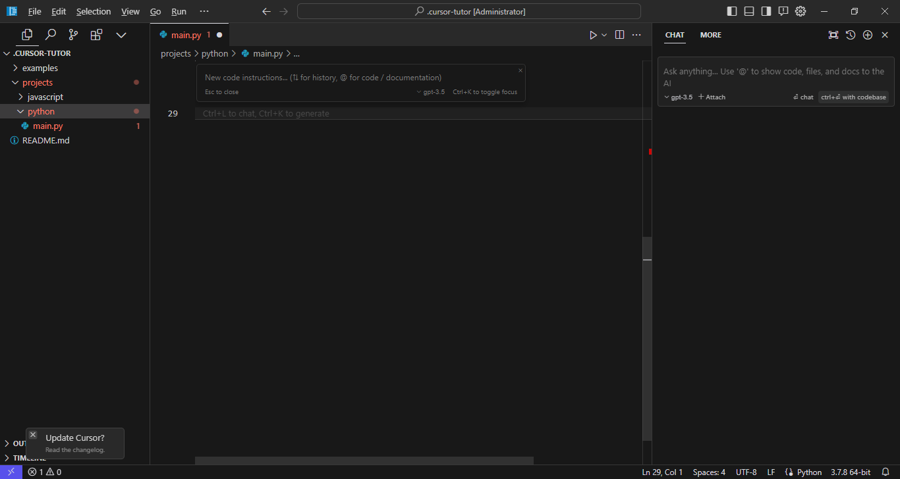

## 测试
>  leetcode简单题

Ctrl + K:输入问题

给定一个整数数组 nums 和一个整数目标值 target，请你在该数组中找出和为目标值 target  的那两个整数，并返回它们的数组下标。

你可以假设每种输入只会对应一个答案。但是，数组中同一个元素在答案里不能重复出现。

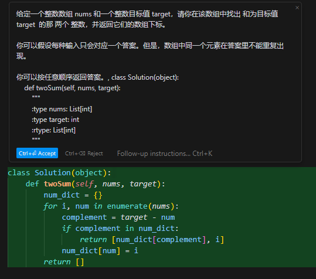

Ctrl + L:询问怎么用这个代码

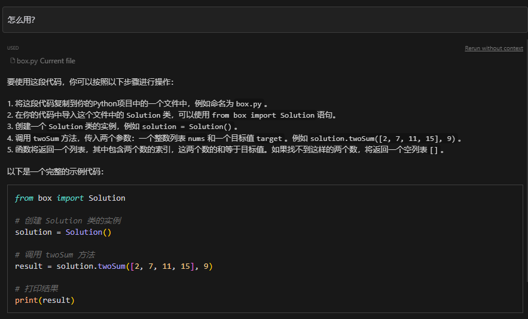

结果:

>Leetcode难题

Ctrl + K:输入问题

给你一个链表数组，每个链表都已经按升序排列。

请你将所有链表合并到一个升序链表中，返回合并后的链表

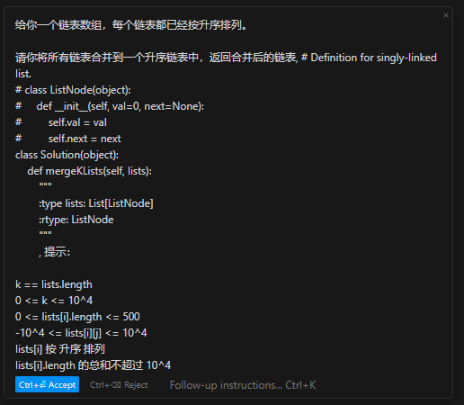

得到代码:

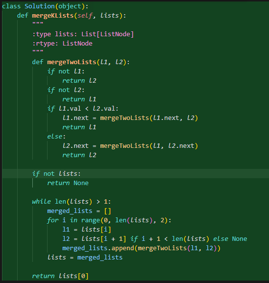

结果显示内存占用大

Ctrl + K:添加描述

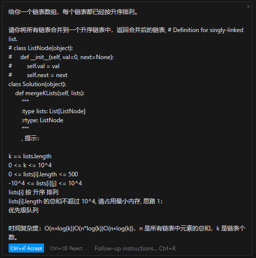

得到代码:

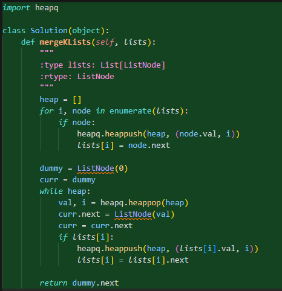

结果:

> 线性规划问题

Ctrl + L：如何求解线性规划问题

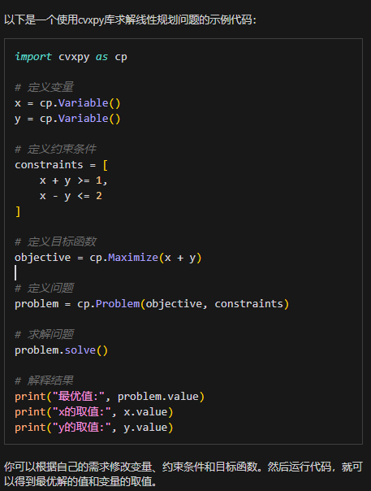

Ctrl + L：如何让结果保留2位小数

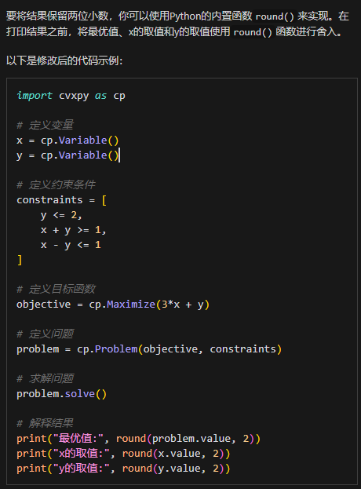

报错了!

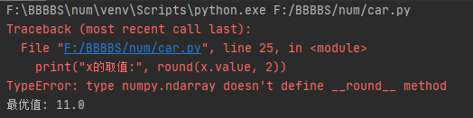

Ctrl + L：把报错结果直接粘过去

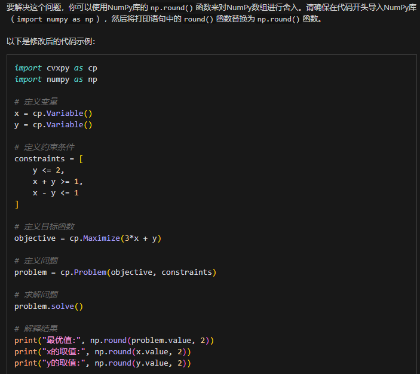

得到结果：

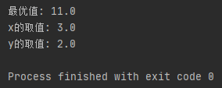
